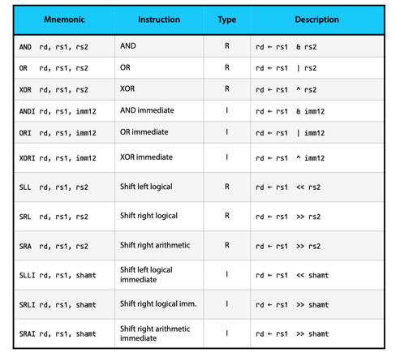

# Pipelined RISC V Core

This repository contains details about a RISC V based pipelined core designed in Verilog HDL and simulated using Xilinx Vivado IDE.
## Introduction to RISC V ISA

RISC-V is an open standard instruction set architecture (ISA) based on established RISC principles. Unlike most other ISA designs, RISC-V is provided under open source licenses that do not require fees to use. A number of companies are offering or have announced RISC-V hardware, open source operating systems with RISC-V support are available, and the instruction set is supported in several popular software toolchains.

## ISA Base and Extensions
RISC-V has a modular design, consisting of alternative base parts, with added optional extensions. The ISA base and its extensions are developed in a collective effort between industry, the research community and educational institutions. The base specifies instructions (and their encoding), control flow, registers (and their sizes), memory and addressing, logic (i.e., integer) manipulation, and ancillaries. The base alone can implement a simplified general-purpose computer, with full software support, including a general-purpose compiler.

### RV32I Base ISA  
The RV32 base instruction ISA is a 32-bit integer ISA, as its name suggests the CPU would contain registers, with each one having 32-bit length. This CPU consists of 32 registers (x1 to x32) with an extra x0 that is hard-wired to zero. It has 47 instructions and is sufficient to satisfy the basic requirements of an operating system.

### RV32E Base ISA  
In RV32I, the most expensive part would be having 31 integer registers, but in some cases not all of them a required and fewer registers would be enough to have sufficient performance, this would not only reduce the cost but also make the device more energy efficient, and that is the aim of RV32E, which has only 15 registers.

### RV64I base ISA  
For many applications today 32-bits of addressable memory is not sufficient. Large servers and modern computations require 46 to 48 bits of addressable memory to fully address. that is why, to expand the use of RISC V in a number of applications, RV64I Base ISA is defined which solves the problem of lack of addresses. RV64I ISA resembles RV32I ISA but the difference is that the widths of integer registers and program counter is doubled in width to 64-bits. There are 12 new instructions included in RV64I base ISA.

### RV128I base ISA  
Two Designers Gordon Bell and Bill Strecker while working on architecture designs stated that the only problem that can be faced in future in the field of Processor design is not having enough bits for memory addressing and memory management. While 64 bits of address space is enough for nearly all computing devices, it is predicted that if in need of an ISA with pre-defined 128-bit address spaces, RISC V will be on the top of the list. Keeping this in mind, the 128-bit address space variant is included in the BASE ISA.

### RISC V Standard Extensions  
The main aim of creating RISC V ISA is to make it suitable for all computing devices and to support research in data-parallel architectures. Some Applications demand low-end implementations and some demand high-performance cores of ISA. RISC V provides such flexibility in the form of ISA Extensions. Four of the popular extensions are defined which make RISC V a powerful ISA for general-purpose computing namely M(for integer multiplication and division), A(for atomic memory operations), F and D(for single and double precision floating point).

In this design, we had used RV32I Base ISA.

## RISC V Instruction Format
There are 6 types of instructions : 

### R Type :

R Type instruction which stands for Register type and has three registers (2 source registers and 1 destination register) namely, rs1, rs2, rd. The operation performed on rs1 and rs2 is defined by funct3, funct7 fields and the result will be stored in rd.

### I Type :

I Type instruction which stands for immediate type has an immediate operand, this operand is of 12 bits size but is sign extended when used in computations the operation described by field funct3 is done on the sign extended immediate data and contents of rs1 and stored in rd.

### S Type :

S Type which stands for store type is used to write value into register, the value to be stored here is rs2 and destination address is calculated by adding rs1 and sign extended 12-bit immediate data, funct3 here defines the operation (for example storing word or half word, etc)

### B Type :

B Type instruction which stands for Branch type instruction, checks condition using rs1 and rs2 as operands and will jump to an address defined by immediate value if true. The address is calculated by adding the contents of the PC along with the 12-bit sign extended immediate value.

### U Type :

U Type instruction which stands for upper immediate type are instructions with upper immediate values and value stored here is the immediate data which is stored as most significant bits and zeros are appended to it at the LSB.

### J Type :

J Type instruction which stands for jump type instruction is used to jump to a particular location defined by the immediate value.
## Types of Operations 

### Arithmetic Operations : 

 

### Logical Operations : 

 

### Load/Store Operations : 

 

### Branch Operations : 

 

## Architecture

Below shows the architecture of the design : 

 

## The five stage pipeline

### Instruction fetch : 
The next instruction is fetched from the memory address that is currently stored in the program counter and stored into the instruction register. At the end of the fetch operation, the PC points to the next instruction that will be read at the next cycle.

### Instruction decode : 
The decoding process allows the CPU to determine what instruction is to be performed so that the CPU can tell how many operands it needs to fetch in order to perform the instruction. The opcode fetched from the memory is decoded for the next steps and moved to the appropriate registers.

### Execute : 
The control unit of the CPU passes the decoded information as a sequence of control signals to the relevant functional units of the CPU to perform the actions required by the instruction, such as reading values from registers, passing them to the ALU to perform mathematical or logic functions on them, and writing the result back to a register. If the ALU is involved, it sends a condition signal back to the CU. The result generated by the operation is stored in the main memory or sent to an output device. Based on the feedback from the ALU, the PC may be updated to a different address from which the next instruction will be fetched.

### Memory access : 
If data memory needs to be accessed, it is done in this stage. During this stage, single cycle latency instructions simply have their results forwarded to the next stage. This forwarding ensures that both one and two cycle instructions always write their results in the same stage of the pipeline so that just one write port to the register file can be used, and it is always available.

### Writeback :
During this stage, both single cycle and two cycle instructions write their results into the register file. Note that two different stages are accessing the register file at the same time -- the decode stage is reading two source registers, at the same time that the writeback stage is writing a previous instruction's destination register. On real silicon, this can be a hazard (see below for more on hazards). That is because one of the source registers being read in decode might be the same as the destination register being written in writeback. When that happens, then the same memory cells in the register file are being both read and written the same time. On silicon, many implementations of memory cells will not operate correctly when read and written at the same time.

## Waveform : 

 

#### Note : 
This design is not capable of handling any type of hazards.

Suggestions and contributions will be accepted and appreciated.

## Guided By : 

### [Dr. T. V. Kalyan](https://sites.google.com/view/kalyantv)
Assistant Professor

Dept. of Computer Science and Engineering

Indian Institute of Technology Ropar.
